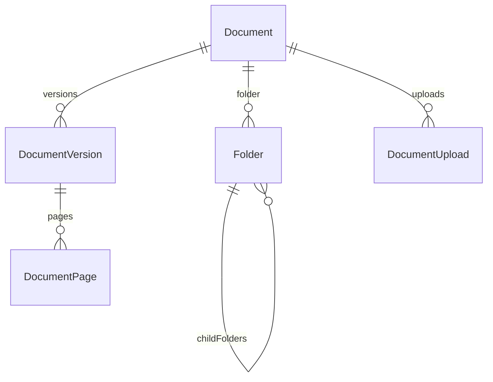
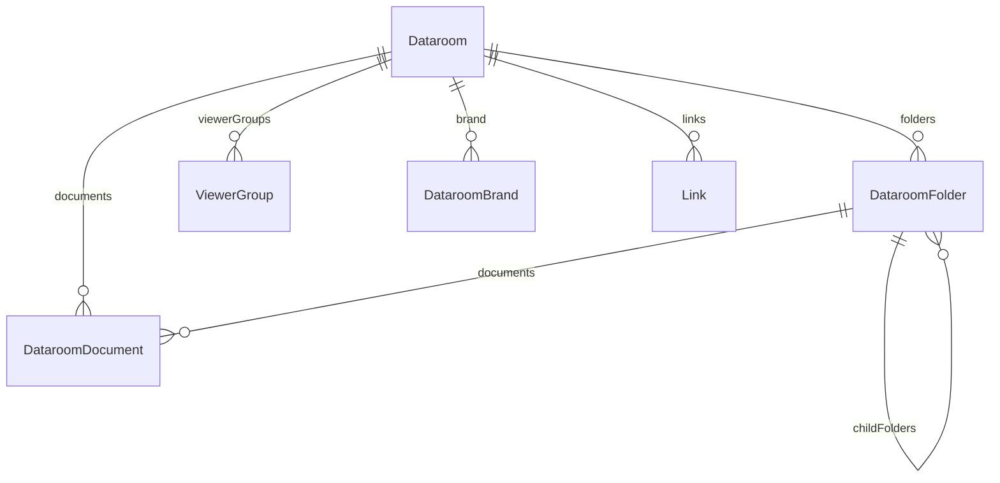
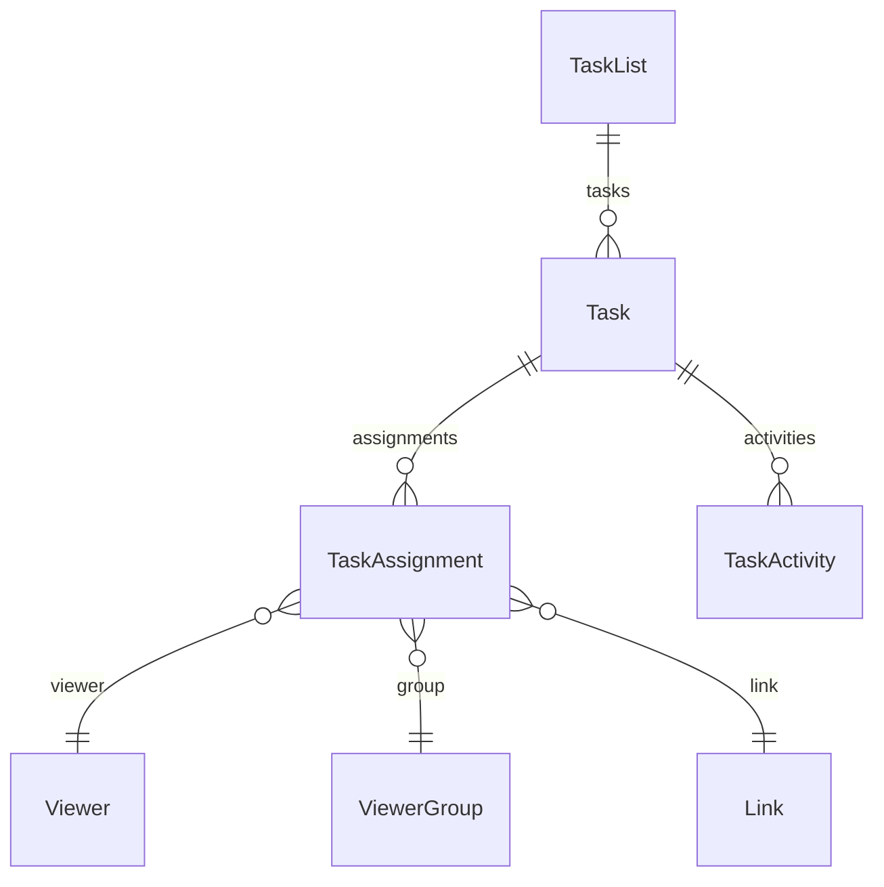

# prisma — schema

# Prisma Schema — Document Sharing Platform

This Prisma schema defines the data model for Papermark, a document sharing and collaboration platform. The schema supports multi-tenant document management, secure link sharing, viewer tracking, datarooms, AI-powered chat, conversation threads, and task/request list workflows.

## Architecture Overview

The schema is organized into logical feature domains, each in its own file:

| File | Purpose |
|------|---------|
| `schema.prisma` | Core models: User, Team, View, Viewer, Chat |
| `team.prisma` | Team membership and roles |
| `document.prisma` | Document storage and versioning |
| `link.prisma` | Link sharing and presets |
| `dataroom.prisma` | Virtual data rooms with folders, branding, and request lists |
| `conversation.prisma` | Threaded conversations and FAQ system |
| `annotation.prisma` | Document annotations with attached images |
| `workflow.prisma` | Email routing based on visitor attributes |
| `notification.prisma` | User notification preferences |
| `oauth.prisma` | OAuth 2.0 client and token management |
| `integration.prisma` | Third-party integration registry |
| `jackson.prisma` | SAML/SCIM tables (managed by BoxyHQ Jackson) |

## Core Entities

### Team

`Team` is the top-level tenant. All resources belong to a team:

```prisma
model Team {
  id            String    @id @default(cuid())
  name          String
  slug          String?   @unique  // For SSO login (e.g., "acme")
  plan          String    @default("free")
  stripeId      String?   @unique
  ssoEnabled    Boolean   @default(false)
  ssoEmailDomain String?  @unique  // Enforced SSO domain
  // ... relations to documents, users, datarooms, links, etc.
}
```

### User

`User` represents internal team members. Authentication is handled via NextAuth (`Account`, `Session`, `VerificationToken`).

```prisma
model User {
  id             String    @id @default(cuid())
  email          String?   @unique
  teams          UserTeam[]
  documents      Document[]
  restrictedTokens RestrictedToken[]  // API keys
  // ... per-feature relations
}
```

### Viewer

`Viewer` represents external visitors who access shared links:

```prisma
model Viewer {
  id        String   @id @default(cuid())
  email     String
  dataroomId String?  // Optionally scoped to a dataroom
  teamId    String
  views     View[]
  groups    ViewerGroupMembership[]
  // ... per-feature relations
}
```

The unique constraint `@@unique([teamId, email])` prevents duplicate viewer records across a team.

## Document Storage



### Document Model

```prisma
model Document {
  id                   String    @id @default(cuid())
  name                 String
  file                 String    // S3/blob URL
  originalFile         String?   // Original format (pptx, xlsx)
  contentType          String?   // MIME type
  storageType          DocumentStorageType @default(VERCEL_BLOB)
  numPages             Int?
  ownerId              String?
  owner                User?     @relation(...)
  teamId               String
  folderId             String?
  folder               Folder?   @relation(...)
  versions             DocumentVersion[]
  datarooms            DataroomDocument[]
  annotations          DocumentAnnotation[]
  tags                 TagItem[]
}
```

### Version Control

`DocumentVersion` stores versioned file variants:

```prisma
model DocumentVersion {
  id                String    @id @default(cuid())
  versionNumber     Int
  documentId        String
  file              String
  isPrimary         Boolean   @default(false)
  vectorStoreFileId String?   // For AI search
  pages             DocumentPage[]
  hasPages          Boolean   @default(false)
}
```

Unique constraint `@@unique([versionNumber, documentId])` ensures sequential versioning.

### Folder Structure

Folders use materialized paths for hierarchical queries:

```prisma
model Folder {
  path       String  // e.g., "/sales/q4/proposals"
  parentId   String?
  documents  Document[]
  childFolders Folder[] @relation("SubFolders")
}
```

Unique constraint `@@unique([teamId, path])` enforces path uniqueness per team.

## Link Sharing

Links are the primary mechanism for sharing documents and datarooms:

```prisma
model Link {
  id          String    @id @default(cuid())
  linkType    LinkType  @default(DOCUMENT_LINK)
  documentId  String?
  dataroomId  String?
  url         String?   @unique  // Generated shareable URL
  slug        String?   // Pretty URL slug
  domainId    String?
  domain      Domain?   @relation(...)
  domainSlug  String?   // Persisted even if domain deleted
  
  // Access control
  password          String?
  allowList         String[]
  denyList          String[]
  emailProtected    Boolean  @default(true)
  
  // Features
  enableWatermark   Boolean  @default(false)
  watermarkConfig   Json?
  enableAgreement   Boolean  @default(false)
  enableConversation Boolean @default(false)
  enableAIAgents    Boolean?
  
  // Group-based access
  audienceType      LinkAudienceType @default(GENERAL)
  groupId           String?
  group             ViewerGroup?     @relation(...)
  
  // Granular permissions
  permissionGroupId String?
  permissionGroup   PermissionGroup? @relation(...)
  
  views      View[]
  conversations Conversation[]
  teamId     String?
  team       Team?   @relation(...)
}
```

### Link Presets

`LinkPreset` allows teams to define reusable link configurations:

```prisma
model LinkPreset {
  name            String
  teamId          String
  isDefault       Boolean @default(false)
  // All the same fields as Link for defaults
  enableWatermark Boolean? @default(false)
  watermarkConfig Json?
  // ... etc
}
```

## Datarooms

Datarooms are virtual data rooms that aggregate multiple documents:



### Dataroom Model

```prisma
model Dataroom {
  id           String  @id @default(cuid())
  pId          String  @unique  // Public ID: "dr_1234"
  name         String
  internalName String?  // Private alias
  
  // Features
  conversationsEnabled Boolean @default(false)
  faqEnabled           Boolean  // via faqItems relation
  agentsEnabled        Boolean @default(false)
  requestListEnabled   Boolean @default(false)
  allowBulkDownload    Boolean @default(true)
  
  // Display
  introductionEnabled  Boolean @default(false)
  introductionContent  Json?   // TipTap JSON
  showLastUpdated      Boolean @default(true)
  
  // Frozen state
  isFrozen             Boolean @default(false)
  frozenAt             DateTime?
  freezeArchiveUrl     String?
  
  // Default strategies
  defaultPermissionStrategy     DefaultPermissionStrategy @default(INHERIT_FROM_PARENT)
  defaultGroupPermissionStrategy DefaultPermissionStrategy @default(INHERIT_FROM_PARENT)
  defaultShowBanner             Boolean @default(true)
  
  teamId      String
  documents   DataroomDocument[]
  folders     DataroomFolder[]
  links       Link[]
  viewers     Viewer[]
  viewerGroups ViewerGroup[]
  brand       DataroomBrand?
  taskLists   TaskList[]
  faqItems    DataroomFaqItem[]
  chats       Chat[]
}
```

### Permission Strategy

The `DefaultPermissionStrategy` enum controls how new documents are scoped:

```prisma
enum DefaultPermissionStrategy {
  INHERIT_FROM_PARENT  // New items inherit parent permissions
  ASK_EVERY_TIME       // Require explicit permission assignment
  HIDDEN_BY_DEFAULT    // New items hidden until explicitly made visible
}
```

### Dataroom Branding

```prisma
model DataroomBrand {
  logo                          String?
  banner                        String?
  brandColor                    String?
  accentColor                   String?
  accentButtonColor             String?
  
  // Layout
  cardLayout            String  @default("LIST")
  showFolderTree        Boolean @default(true)
  viewerLayoutPreset    String  @default("STANDARD")
  viewerHeaderStyle     String  @default("DEFAULT")
  
  // Custom link preview (OG tags)
  customLinkPreviewEnabled Boolean @default(false)
  linkPreviewTitle         String?
  linkPreviewImage         String?
  
  // Language override
  defaultLanguage String @default("en")  // BCP-47
  
  dataroomId String @unique
  dataroom   Dataroom @relation(...)
}
```

## View Tracking

`View` records each document/dataroom access:

```prisma
model View {
  id           String    @id @default(cuid())
  linkId       String
  link         Link      @relation(...)
  documentId   String?
  dataroomId   String?
  viewerEmail  String?
  viewerName   String?
  verified     Boolean   @default(false)
  viewedAt     DateTime  @default(now())
  downloadedAt DateTime?
  downloadType DownloadType?  // SINGLE, BULK, FOLDER
  viewType     ViewType @default(DOCUMENT_VIEW)
  viewerId     String?
  viewer       Viewer?   @relation(...)
  groupId      String?
  group        ViewerGroup? @relation(...)
  
  // Responses
  feedbackResponse    FeedbackResponse?
  agreementResponse   AgreementResponse?
  customFieldResponse CustomFieldResponse?
  
  // Relations
  reactions      Reaction[]
  messages       Message[]
  taskActivities TaskActivity[]
  uploadedDocuments DocumentUpload[]
}
```

## Access Control

### Viewer Groups

Viewer groups manage permissions for sets of viewers:

```prisma
model ViewerGroup {
  id        String  @id @default(cuid())
  name      String
  domains   String[]  // Allowed email domains
  allowAll  Boolean @default(false)  // Accept any email
  
  dataroomId String
  teamId     String
  
  accessControls ViewerGroupAccessControls[]
  members        ViewerGroupMembership[]
  links          Link[]
}

model ViewerGroupAccessControls {
  itemId   String
  itemType ItemType  // DATAROOM_DOCUMENT, DATAROOM_FOLDER
  canView     Boolean @default(true)
  canDownload Boolean @default(false)
}
```

### Permission Groups

For link-level permissions:

```prisma
model PermissionGroup {
  dataroomId String
  accessControls PermissionGroupAccessControls[]
  links       Link[]
}

model PermissionGroupAccessControls {
  itemId   String
  itemType ItemType
  canView             Boolean @default(true)
  canDownload         Boolean @default(false)
  canDownloadOriginal Boolean @default(false)
}
```

## Conversations & FAQ

### Threaded Conversations

```prisma
model Conversation {
  visibilityMode ConversationVisibility @default(PRIVATE)
  // PUBLIC_LINK, PUBLIC_GROUP, PUBLIC_DOCUMENT, PUBLIC_DATAROOM
  
  dataroomId          String
  dataroomDocumentId  String?  // Optional document context
  documentPageNumber  Int?
  linkId              String?
  viewerGroupId       String?
  
  participants ConversationParticipant[]
  messages     Message[]
  views        ConversationView[]  // All views that accessed this conversation
}

model ConversationParticipant {
  role ParticipantRole @default(PARTICIPANT)
  viewerId String?
  userId   String?
  receiveNotifications Boolean @default(false)
}

model Message {
  content       String
  conversationId String
  userId        String?  // Team member sender
  viewerId      String?  // Visitor sender
  viewId        String?  // Context of where message was sent
  isRead        Boolean  @default(false)
}
```

### FAQ System

Conversations can be published as FAQs:

```prisma
model DataroomFaqItem {
  editedQuestion   String
  originalQuestion String?
  answer           String
  
  dataroomId       String
  linkId           String?  // Optional link-specific FAQ
  dataroomDocumentId String?
  
  sourceConversationId String?
  questionMessageId    String?  @relation("FAQQuestionMessage")
  answerMessageId      String?  @relation("FAQAnswerMessage")
  
  visibilityMode FaqVisibility @default(PUBLIC_DATAROOM)
  status         FaqStatus     @default(PUBLISHED)
  isAnonymized   Boolean       @default(true)
  
  viewCount      Int @default(0)
  tags           String[] @default([])
}
```

## AI Chat

```prisma
model Chat {
  title       String?
  teamId      String
  
  // Context (exactly one set)
  documentId  String?
  dataroomId  String?
  linkId      String?
  viewId      String?
  
  // Participants
  userId      String?
  viewerId    String?
  
  vectorStoreId String?  // OpenAI vector store for RAG
  messages      ChatMessage[]
  lastMessageAt DateTime?
}

model ChatMessage {
  chatId   String
  role     String  // "user", "assistant", "system"
  content  String  @db.Text
  metadata Json?   // Sources, page numbers, etc.
}
```

## Task System (Request Lists)

The task system allows dataroom owners to request actions from viewers:



### Models

```prisma
model TaskList {
  name       String
  orderIndex Int?
  dataroomId String
  tasks      Task[]
}

model Task {
  title       String
  type        String  @default("TODO")  // TODO, UPLOAD, ACKNOWLEDGE
  status      String  @default("OPEN")  // OPEN, IN_PROGRESS, SUBMITTED, COMPLETED
  category    String?  // "Financial", "Tax", etc.
  dueDate     DateTime?
  orderIndex  Int?
  
  taskListId String
  dataroomId String
  assignments TaskAssignment[]
  activities  TaskActivity[]
}

model TaskAssignment {
  // Exactly one of these is set
  viewerId String?
  groupId  String?
  linkId   String?
  email    String?
  
  notifiedAt     DateTime?
  lastReminderAt DateTime?
}

model TaskActivity {
  type       String  // CREATED, ASSIGNED, STATUS_CHANGED, COMMENT
  comment    String?
  fromStatus String?
  toStatus   String?
  
  // Actor
  userId   String?
  viewerId String?
  viewId   String?
}
```

## Document Annotations

```prisma
model DocumentAnnotation {
  title       String
  content     Json   // TipTap/ProseMirror JSON
  pages       Int[]  // Affected page numbers
  
  documentId  String
  teamId      String
  createdById String
  isVisible   Boolean @default(true)  // Admin toggle
  
  images      AnnotationImage[]
}

model AnnotationImage {
  filename String
  url      String
  size     Int?
  mimeType String?
  
  annotationId String
}
```

## Workflows

Workflows route visitors to different links based on email/domain rules:

```prisma
model Workflow {
  entryLinkId String @unique
  isActive    Boolean @default(true)
  steps       WorkflowStep[]
  executions  WorkflowExecution[]
}

model WorkflowStep {
  stepOrder  Int
  stepType   WorkflowStepType @default(ROUTER)
  conditions Json   // Array of conditions
  actions    Json   // Array of actions
}

model WorkflowExecution {
  visitorEmail String?
  visitorIp    String?
  status       ExecutionStatus
  result       Json?  // Target link
  stepLogs     WorkflowStepLog[]
}
```

## API Keys

```prisma
model RestrictedToken {
  name        String
  hashedKey   String    @unique
  partialKey  String    // First 8 chars for display
  scopes      String?   // "apis.all" or granular
  mode        String    @default("live")  // "live" | "test"
  source      String    @default("dashboard")  // "dashboard" | "oauth"
  subjectType String    @default("user")  // "user" | "machine"
  clientId    String?   // OAuth client reference
  expires     DateTime?
  lastUsed    DateTime?
  rateLimit   Int       @default(60)  // per minute
  
  userId      String
  teamId      String
}
```

## Indexes

The schema relies heavily on indexes for query performance:

```prisma
// Common patterns:
// Team-scoped lookups
@@index([teamId])

// Foreign key joins
@@index([documentId])
@@index([linkId])
@@index([viewerId])

// Time-series queries
@@index([viewedAt(sort: Desc)])

// Partial/composite indexes
@@index([documentId, isArchived])
@@index([viewerId, documentId])
@@index([teamId, hiddenInAllDocuments])
```

## Key Design Patterns

### 1. Soft Deletes

Links use a `deletedAt` timestamp for soft deletion:

```prisma
model Link {
  deletedAt DateTime?
  // Filter with: where: { deletedAt: null }
}
```

### 2. Denormalized Path Storage

Folder paths are materialized (stored explicitly) for efficient tree queries without recursive CTEs:

```prisma
model Folder {
  path     String  // "/sales/q4/proposals"
  parentId String?
}
```

### 3. JSON for Flexible Data

Several fields use `Json` type for schema flexibility:

```prisma
model DocumentPage {
  pageLinks Json?   // [{href, coords}]
  metadata  Json?   // {originalWidth, scaledWidth, scaleFactor}
}
```

### 4. Polymorphic Relations

Some relations use `itemType` discriminator for polymorphic associations:

```prisma
model TagItem {
  itemType TagType  // LINK_TAG, DOCUMENT_TAG, DATAROOM_TAG
  linkId   String?
  documentId String?
  dataroomId String?
}
```

### 5. Separate Permission Strategies

Datarooms maintain separate permission strategies for link-level (`defaultPermissionStrategy`) and group-level (`defaultGroupPermissionStrategy`) access, allowing different defaults for each access path.