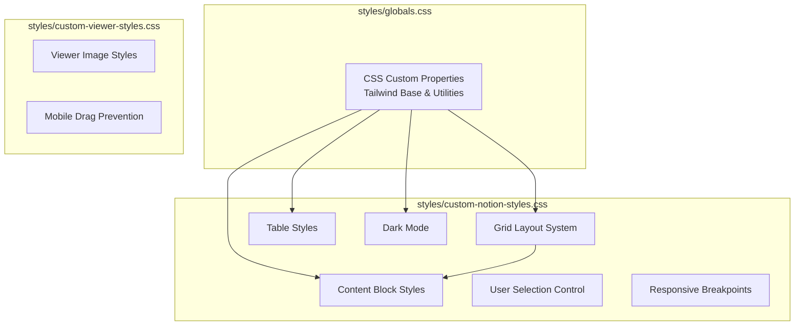

# styles

# Styles Module

The styles module provides a complete Notion-inspired styling system for the application. It consists of three CSS files that work together to create a consistent, responsive, and accessible content viewing experience.

## Architecture Overview



## File Structure

| File | Purpose |
|------|---------|
| `globals.css` | CSS custom properties, Tailwind base layer, and animation utilities |
| `custom-notion-styles.css` | Notion-style grid layout, content blocks, tables, and dark mode |
| `custom-viewer-styles.css` | Image viewer-specific styles for mobile drag prevention |

---

## Grid Layout System

The module implements a CSS Grid-based layout that mirrors Notion's content structure. The grid uses named lines for precise content positioning.

### Named Grid Lines

```
[full-start] ─ [margin] ─ [content-start] ─ 708px ─ [content-end] ─ [margin] ─ [full-end]
```

**CSS Variables:**

```css
:root {
  --notion-max-width: 990px;      /* Total page width */
  --notion-content-width: 708px;  /* Main content column */
  --notion-margin-width: minmax(96px, 1fr); /* Flexible side margins */
}
```

### Grid Behavior by Content Type

| Content Type | Grid Column | Behavior |
|--------------|-------------|----------|
| Regular blocks | `content` | Centered within content width |
| Collections | `full` | Spans entire viewport width |
| Simple tables | `content-start / -1` | Aligned with content, extends to full width |

### Full-Width Pages

For pages with `page_full_width: true`, the grid switches to fixed 96px margins:

```css
@media (min-width: 769px) {
  .notion-page.notion-full-page.notion-full-width {
    grid-template-columns:
      [full-start] 96px
      [content-start] minmax(0, 1fr)
      [content-end] 96px
      [full-end];
  }
}
```

This ensures full-width pages span the viewport like on notion.so.

---

## User Selection Control

The module provides granular control over text selection behavior.

### Default: Selection Disabled

All Notion content blocks have text selection disabled by default:

```css
.notion-page,
.notion-text,
.notion-h1,
/* ... all block types ... */ {
  user-select: none;
}
```

### Enabled State

Selection is re-enabled via a parent class `.notion-text-selection-enabled`:

```css
.notion-text-selection-enabled .notion-page,
.notion-text-selection-enabled .notion-text,
/* ... */ {
  user-select: text;
}
```

**Usage Pattern:** Apply `.notion-text-selection-enabled` to a parent element to enable text selection within that subtree.

---

## Image and Media Handling

### Drag Prevention

Images have user selection and touch interactions disabled to prevent accidental saving:

```css
.notion-image,
.notion-asset,
img {
  -webkit-touch-callout: none;
  user-select: none;
  -webkit-tap-highlight-color: transparent;
  pointer-events: auto; /* Keep clickable */
}
```

### Interactive Elements

Links and buttons retain pointer events for normal interaction:

```css
.notion-link,
a,
button,
input,
select,
textarea,
.notion-toggle-button,
.notion-page-icon {
  pointer-events: auto !important;
  cursor: pointer !important;
}
```

---

## Table Styles

### Simple Tables

Simple tables use the `content-start / -1` grid span, allowing them to extend from the content area to the right edge:

```css
.notion-simple-table {
  grid-column: content-start / -1;
  overflow-x: auto;
}
```

### Table Cell Styling

```css
.notion-simple-table td {
  padding: 8px 10px;
  border: 1px solid rgb(210, 210, 208);
}
```

### Table Header Styling

Header rows and cells have a distinct background:

```css
.notion-simple-table-header-row td,
.notion-simple-table-header-cell {
  background: rgb(247, 246, 243);
  font-weight: 500;
}
```

---

## Dark Mode Support

Dark mode is implemented using the `.dark` class on a parent element. The styles adjust both color values and table borders for visibility.

### CSS Variables in Dark Mode

```css
.dark {
  --background: 224 71.4% 4.1%;
  --foreground: 210 20% 98%;
  --border: 215 27.9% 16.9%;
  /* ... */
}
```

### Table Borders in Dark Mode

```css
.dark .notion-simple-table td {
  border-color: rgba(255, 255, 255, 0.2);
}
```

---

## Responsive Design

### Breakpoints

| Breakpoint | Grid Behavior |
|------------|---------------|
| `≥ 769px` | Full grid with 96px margins, fixed table widths |
| `≤ 768px` | Reduced margins (24px), tables use native sizing |
| `≤ 640px` | Column layout stacks vertically |

### Mobile Table Handling

```css
@media (max-width: 768px) {
  .notion-simple-table {
    grid-column: content;
    display: block;
    max-width: 100%;
    overflow-x: auto;
  }
}
```

### Column Stacking

```css
@media (max-width: 640px) {
  .notion-row {
    flex-wrap: wrap;
    gap: 1rem;
  }

  .notion-row > .notion-column {
    width: 100% !important;
  }
}
```

---

## Animation Utilities

### Fade-In Animation

```css
@keyframes fade-in {
  from { opacity: 0; }
  to { opacity: 1; }
}

.animate-fade-in {
  animation: fade-in 0.5s ease-in-out;
}
```

---

## Touch Optimization Utilities

The `globals.css` provides utility classes for optimized touch interactions:

```css
.touch-action-manipulation {
  touch-action: manipulation; /* Remove 300ms delay */
}

.touch-zoom-container {
  touch-action: none;              /* Disable browser handling */
  -webkit-overflow-scrolling: touch;
  isolation: isolate;              /* New stacking context */
  contain: paint;                  /* Optimize rendering */
}
```

---

## Integration with react-notion-x

The styles target specific classes rendered by react-notion-x:

| react-notion-x Class | Styling Applied |
|----------------------|-----------------|
| `.notion-page-content-inner` | Grid container |
| `.notion-page.notion-full-width` | Full-width grid |
| `.notion-collection` | Full-width span |
| `.notion-page-icon-hero` | Overlapping cover, negative margin positioning |
| `.notion-asset-wrapper` | Video/iframe sizing |

### Icon Positioning

Page icons are styled to overlap the cover image, matching Notion's design:

```css
.notion-page-icon-hero {
  margin-top: -70px !important;
  position: relative;
  z-index: 10;
}
```

---

## Usage

Import the stylesheets in your application entry point:

```css
/* In your main CSS or component */
@import './styles/globals.css';
@import './styles/custom-notion-styles.css';
@import './styles/custom-viewer-styles.css';
```

Or in your HTML:

```html
<link rel="stylesheet" href="/styles/globals.css">
<link rel="stylesheet" href="/styles/custom-notion-styles.css">
<link rel="stylesheet" href="/styles/custom-viewer-styles.css">
```

---

## Customization

### Adjusting Content Width

Modify the CSS custom property to change the main content width:

```css
:root {
  --notion-content-width: 800px; /* Increase content width */
}
```

### Adjusting Margins

```css
:root {
  --notion-margin-width: minmax(120px, 1fr); /* Wider margins */
}
```

### Adding Custom Block Selection

Extend selection control to custom block types:

```css
.notion-text-selection-enabled .notion-custom-block {
  user-select: text;
}
```